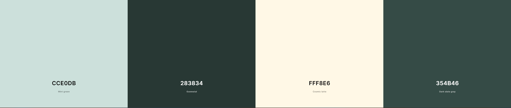
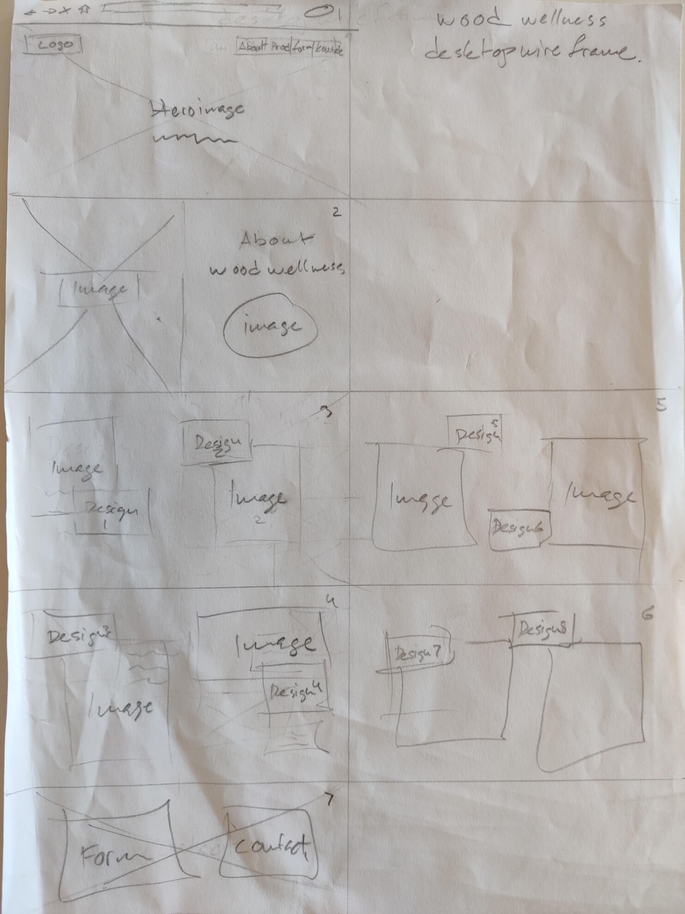
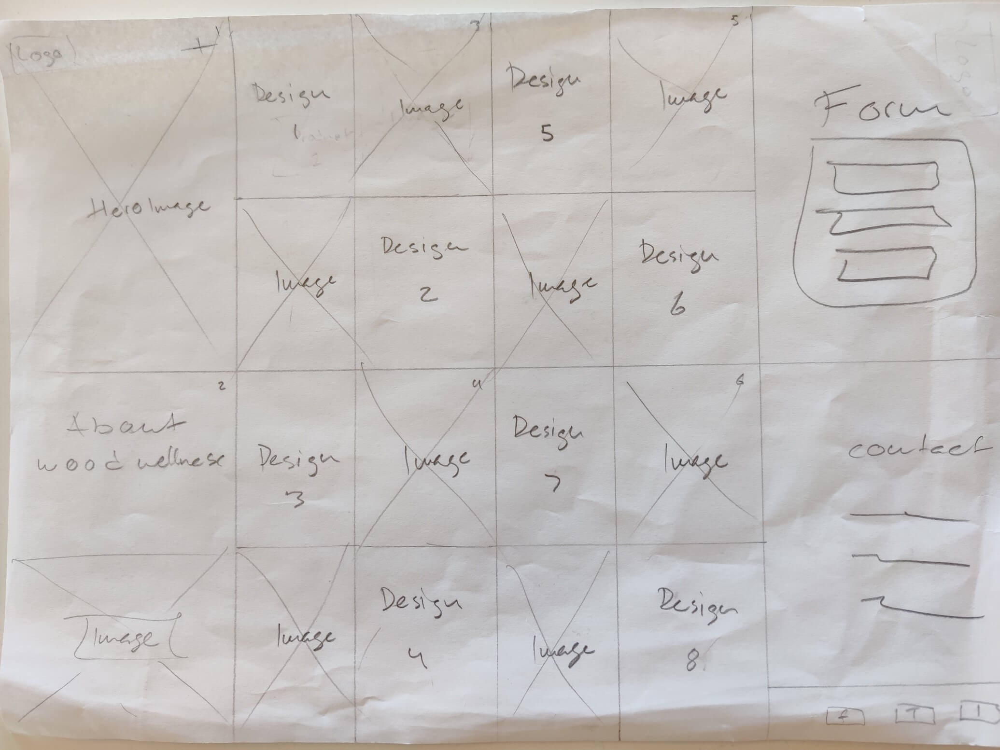

# Wood Wellness

Wood Wellness is a website that aims to showcase the philosophy and work process of their furniture design. The site is intended for users who seek to purchase a certain design or to find the right designer to hire for projects. Wood Wellness includes a philosophy section, showing the designers passion with the goal to inspire the user. The design section serves as a digital gallery to exhibit a diverse range of designs. The connect section lets the user easily get in touch for inquiries or collaborations.

Live link to website - [Wood Wellness](https://luddehs.github.io/Wood-Wellness/)

Table of Contents

  * [Site Owner Goals](#site-owner-goals)
  * [Design](#design)
    + [Imagery](#imagery)
    + [Colour Scheme](#colour-scheme)
    + [Fonts](#fonts)
    + [Layout](#layout)
    + [Wireframes](#wireframes)
  * [Features](#features)
    + [Home Page](#home-page)
    + [How to Play Page](#how-to-play-page)
    + [Leaderboard](#leaderboard)
    + [Game Selection](#game-selection)
    + [Game Area](#game-area)
      - [Easy Game](#easy-game)
      - [Hard Game](#hard-game)
    + [Game Over](#game-over)
    + [Features Left to Implement](#features-left-to-implement)
  * [Testing](#testing)
    + [Validator Testing](#validator-testing)
      - [HTML](#html)
      - [CSS](#css)
      - [Javascript](#javascript)
      - [Accessibility](#accessibility)
    + [Input Testing](#input-testing)
    + [Button Testing](#button-testing)
    + [Game Testing](#game-testing)
    + [Browser Testing](#browser-testing)
    + [Device Testing](#device-testing)
    + [Fixed Bugs](#fixed-bugs)
      - [SetTimeout() method on incorrect cards](#settimeout---method-on-incorrect-cards)
      - [Making a Deep Clone of an Object](#making-a-deep-clone-of-an-object)
      - [Username Input Data Validation](#username-input-data-validation)
    + [Known Bugs](#known-bugs)
  * [Technologies Used](#technologies-used)
    + [Languages](#languages)
    + [Frameworks - Libraries - Programs Used](#frameworks---libraries---programs-used)
  * [Deployment](#deployment)
  * [Cloning](#cloning)
  * [Credits](#credits)
    + [Content](#content)
    + [Media](#media)
    + [Resources Used](#resources-used)
  * [Acknowledgments](#acknowledgments)

## Site Owner Goals 
- To provide the user with a website showcasing furniture designs by Wood Wellness
- To raise brand awareness and accentuate brand identity through the use of appropriate colours imagery and text.
- To present the user with a website that is easy to navigate, fully responsive and has a clear purpose.
- To enable the user to book an appointment for consultation.
  

## Design

### Imagery
The imagery used on the Wood Wellness website is vital for the user to grasp the different designs and for the overall experience. The furniture design photos was taken on various occations in different locations. Multiple angles were shot in daylight to highlight every detail of each design. 

### Colours
The colour scheme of the site was given careful consideration to ensure they compliment the imagery and invoke a sense of calm to the user. A mixture of dark on lighter colors and vice versa, gives contrast to each section and element. To enhance the designs made from various wood species, the chosen colours were inspired by elements from nature with a metallic tone.

### Fonts
The Figtree font is the main font used throughout the whole website, and appropriately enough it's named after a tree. This font was imported via [Google Fonts](https://fonts.google.com/). The Sans Serif font is used a backup, in case for any reason the main font isn't being imported into the site correctly.

### Wireframes

 

 
Desktop Wireframe

 

Mobile Wireframe

 

## Features

### Navigation
The navigation bar is fully responsive across all devices, with a fixed position showing at the top of the page as the user navigates on every section of the website. Links to the logo, philosophy, design, and connect are included. A dropdown menu will show in the right corner on smaller screens letting the user easily navigate each section.

### The Landing Page Image
The user is met by an inviting image highlighting furniture design that aims to calm the senses. The photograph provides the user with a clean and clear visual representation of the purpose of the site, it grabs their attention and sparks curiosity to explore further designs.

### Philosophy Section
In this section the user is encouraged to read a short text that tells the story and philosophy of Wood Wellness. It will allow the user to see the vision of the designer and what he strives for in each project. The text hover over an image showing a workshop.

### Design section
This section will show varying forms of furniture design through photographs taken in different angles. The photos will show in columns on bigger screens.

### Connect
The users are encouraged to book a consultation in the last section of the website. This is done through a form where the user must leave their contact information and request a specific date and time.

### The Footer
In the footer the user can find links to facebook and instagram by clicking the icons which will open them up in a new tab. This will encourage the user to connect and follow Wood Wellness on social media.

### Features Left to Implement
- Contact information in footer.
- Text message request in form.
- Detailed information of each design.
- Screenshots on README.md.

## Testing

### Validator Testing

#### HTML
- No errors in found the official W3C Markup Validator.
- [W3C Validator Results](https://validator.w3.org/nu/?doc=https%3A%2F%2Fluddehs.github.io%2FWood-Wellness%2F) 

#### CSS
- No errors in found the official W3C CSS Validator.
- [W3C CSS Validator Results](https://jigsaw.w3.org/css-validator/validator?uri=https%3A%2F%2Fluddehs.github.io%2FWood-Wellness%2F&profile=css3svg&usermedium=all&warning=1&vextwarning=&lang=sv)

### Fixed Bugs
- Navigation bar dropdown meny would not toggle vertically at first. In the end it was caused by a typo.
- Philosophy section did not respond as expected on smaller screens. This was resolved by switching the <section> to a 
 element.

## Deployment

The project was deployed using GitHub pages. Follow these steps to deploy using GitHub pages:

1. Go to GitHub.com and open the repository.
2. Near the top of the page, select 'Settings'.
3. Select 'Pages' on the left of the page from the menu bar.
4. Select the 'Branch' dropdown menu and select the main branch then save.
5. A message saying "Your site is published at" followed by the web address, will confirm deployment.

Live link to website - [Wood Wellness](https://luddehs.github.io/Wood-Wellness/)

## Credits

### Media
All images of designs were sourced from Eric Holmberg, designer at Wood Wellness.

- [Unsplash](https://unsplash.com)
  - Barn Images - Philisophy Image
