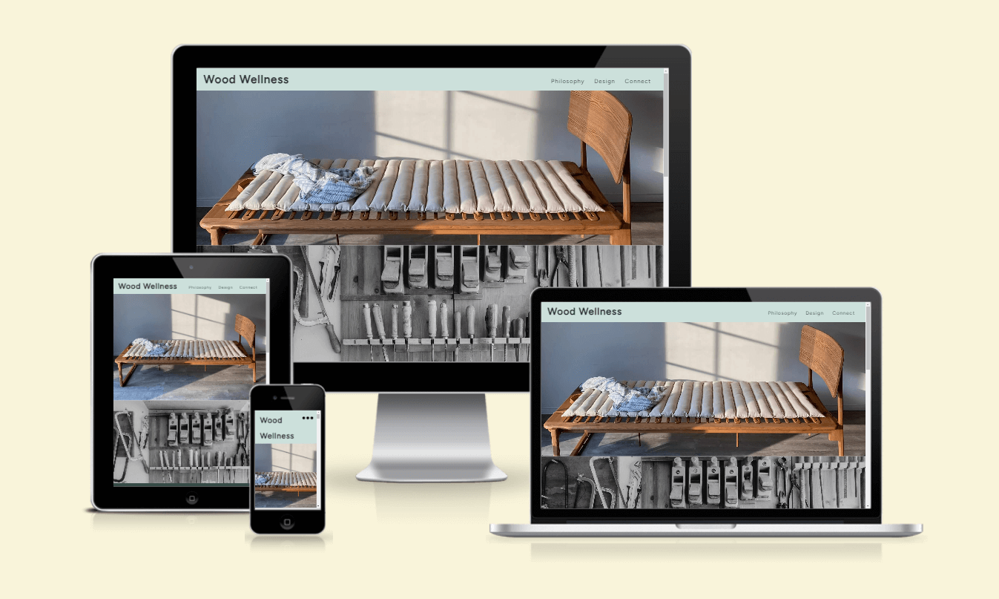
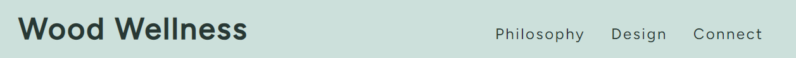
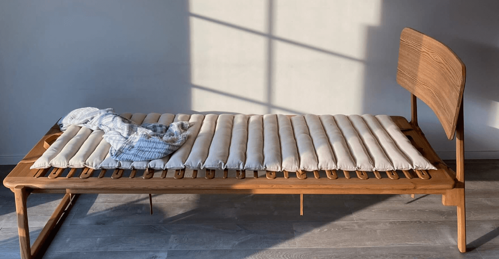
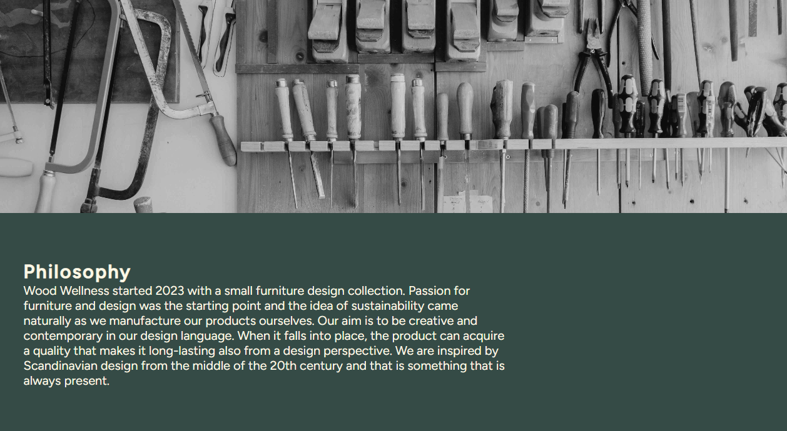
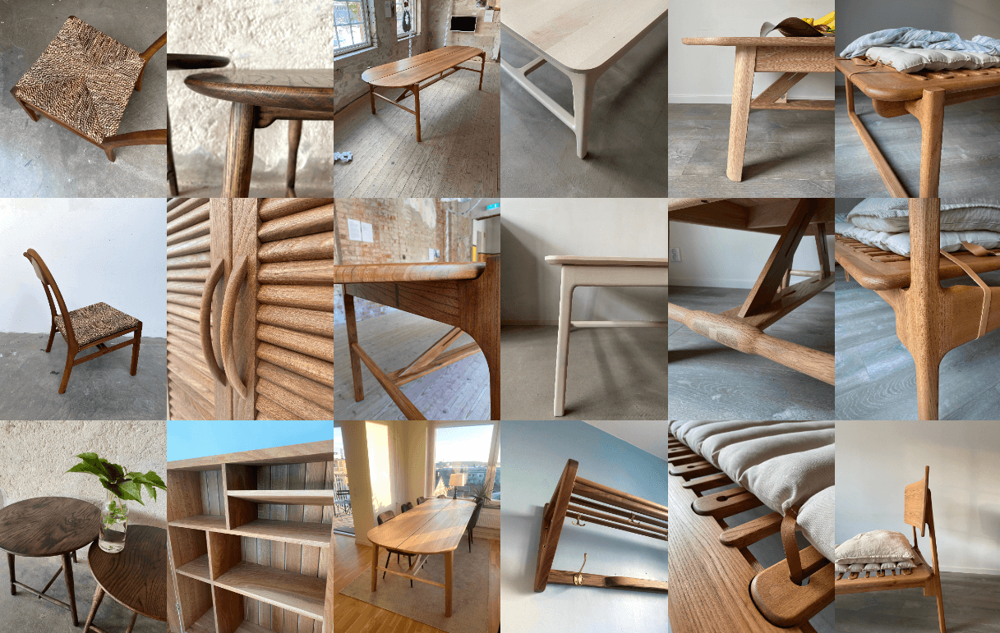
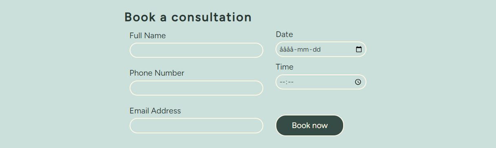
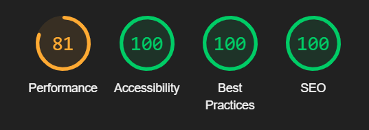

# Wood Wellness

The Wood Wellness website is dedicated to exhibit the philosophy and work process behind their furniture design. The site is intended for an audience who seek to purchase a specific design that resonates with their aesthetic and functional needs or to find the right designer to hire for projects. Wood Wellness includes a philosophy section, showing the designers passion with the goal to inspire the user. The design section serves as a digital gallery to exhibit a diverse range of designs. The connect section lets the user easily get in touch for inquiries or collaborations.

Whether you are looking to purchase a ready-made piece, commission a custom design, or simply explore contemporary furniture design, Wood Wellness welcomes you to discover the style and depth of their craft.

Live link to website - [Wood Wellness](https://luddehs.github.io/Wood-Wellness/)

Table of Contents

  * [Site Owner Goals](#site-owner-goals)
  * [Design](#design)
    + [Imagery](#imagery)
    + [Colour Scheme](#colour-scheme)
    + [Fonts](#fonts)
    + [Wireframes](#wireframes)
  * [Features](#features)
    + [Navigation](#navigation)
    + [Landing Page Image](#landing-page-image)
    + [Philosophy Section](#philosophy-section)
    + [Design Section](#design-section)
    + [Connect Form](#connect-form)
    + [Footer](#footer)
    + [Features Left to Implement](#features-left-to-implement)
  * [Testing](#testing)
    + [Validator Testing](#validator-testing)
      - [HTML](#html)
      - [CSS](#css)
      - [Accessibility](#accessibility)
    + [Form Testing](#form-testing)
    + [Links Testing](#links-testing)
    + [Browser Testing](#browser-testing)
    + [Device Testing](#device-testing)
    + [Fixed Bugs](#fixed-bugs)
    + [Known Bugs](#known-bugs)
  * [Technologies Used](#technologies-used)
    + [Languages](#languages)
    + [Frameworks - Libraries - Programs Used](#frameworks---libraries---programs-used)
  * [Deployment](#deployment)
  * [Credits](#credits)
    + [Content](#content)
    + [Media](#media)
    + [Resources Used](#resources-used)
  * [Acknowledgments](#acknowledgments)

## Site Owner Goals 
- To provide the user with a website showcasing furniture designs by Wood Wellness
- To raise brand awareness and accentuate brand identity through the use of appropriate colours imagery and text.
- To present the user with a website that is easy to navigate, fully responsive and has a clear purpose.
- To enable the user to book an appointment for consultation.
  

## Design

### Imagery
The imagery used on the Wood Wellness website is vital for the user to grasp the different designs and for the overall experience. The furniture design photos was taken on various occations in different locations. Multiple angles were shot in daylight to highlight every detail of each design. 

### Colour Scheme
The colour scheme of the site was given careful consideration to ensure they compliment the imagery and invoke a sense of calm to the user. A mixture of dark on lighter colors and vice versa, gives contrast to each section and element. To enhance the designs made from various wood species, the chosen colours were inspired by elements from nature with a metallic tone.

### Fonts
The Figtree font is the main font used throughout the whole website, and appropriately enough it's named after a tree. This font was imported via [Google Fonts](https://fonts.google.com/). The Sans Serif font is used a backup, in case for any reason the main font isn't being imported into the site correctly.

### Wireframes

 

 
Desktop Wireframe

 

Mobile Wireframe

 

## Features

### Navigation
The navigation bar is designed to be fully responsive, ensuring a seamless experience across all devices. It maintains a fixed position at the top of the page, allowing users to effortlessly access different sections of the website at any time. The bar includes direct links to the homepage via the logo, as well as to key sections such as Philosophy, Design, and Connect. For enhanced usability on smaller screens, a dropdown menu appears in the right corner, offering users a convenient way to navigate through the site's various sections with ease.

### Landing Page Image
The user is met by a captivating image that showcases furniture design in an environment that calms the senses. The photograph provides the user with a clean and clear visual representation of the purpose of the site, it grabs their attention and sparks curiosity to explore additional designs.

### Philosophy Section
In this section, users are encouraged to read a short text that tells the story and philosophy behind Wood Wellness. It offers insight into the designer's vision and the aspirations driving each project, providing a deeper understanding of the creative process. Accompanying the text, an image of a workshop is displayed.

### Design Section
This section is designed to showcase a diverse range of furniture designs, presented through photographs captured from various angles. On larger screens, these images will be displayed in columns.

### Connect Form
In the final section of the website, users are encouraged to book a consultation. This process is facilitated through a form, where users are asked to provide their contact details and select a preferred date and time for their appointment.

### Footer
Within the footer, users can easily access Wood Wellness's social media profiles on Facebook and Instagram by clicking on the respective icons. These links open in new tabs, encouraging users to connect with and follow Wood Wellness on social media platforms.

### Features Left to Implement
- Contact information in footer.
- Text message request in form.
- Detailed description of each design.

## Testing

### Validator Testing

#### HTML
- No errors were returned when passing through the official W3C Markup Validator.
- [W3C Validator Results](https://validator.w3.org/nu/?doc=https%3A%2F%2Fluddehs.github.io%2FWood-Wellness%2F) 

#### CSS
- No errors were found when passing through the official W3C CSS Validator.
- [W3C CSS Validator Results](https://jigsaw.w3.org/css-validator/validator?uri=https%3A%2F%2Fluddehs.github.io%2FWood-Wellness%2F&profile=css3svg&usermedium=all&warning=1&vextwarning=&lang=sv)

#### Accessibility 
- The site achieved a Lighthouse accessibility score of 100%, verifying that the selected colors and fonts are easily readable and accessible.

### Form Testing
- The form has been tested to ensure it will not submit unless the mandatory fields (full name, phone number, email address, date and time) are completed.

### Links Testing
- Each navigation link underwent manual testing to ensure the user is directed to the correct section of the website.
- The social media links located in the footer were manually tested to ensure they lead users to the appropriate page and open in a new window.

### Browser Testing
- The website underwent testing across Google Chrome, Firefox, Microsoft Edge, and Safari browsers without any issues detected.
    
### Device Testing
- The website was tested across multiple devices, including Desktop, Laptop, IPhone, IPad and Android devices, to ensure responsiveness on various screen sizes. It functioned as expected, except for one minor bug stated in [Known Bugs](#known-bugs). Additionally, its responsive design was evaluated using Chrome Developer Tools for various devices, maintaining structural consistency across all sizes.
- To further test responsiveness, I used the following websites:
  - [Am I Responsive](https://ui.dev/amiresponsive?url=https://luddehs.github.io/Wood-Wellness/)
  - [Responsinator](http://www.responsinator.com/?url=https%3A%2F%2Fluddehs.github.io%2FWood-Wellness%2F)

### Fixed Bugs
- Initially, the navigation bar's dropdown menu failed to toggle vertically due to a typo. This issue has been corrected.
- The Philosophy section was not displaying correctly on smaller screens. By changing to a 
 element, this problem has been successfully resolved.

### Known Bugs
- Modify the column count for the Design section within media queries to eliminate empty space across various screen sizes.

## Technologies Used

### Languages
- HTML5
- CSS

### Frameworks - Libraries - Programs Used

- [GitHub](https://github.com/) - Used for version control and hosting.
- [Chrome Dev Tools](https://developer.chrome.com/docs/devtools/) - Used for overall development and tweaking, including responsiveness and performance testing.
- [Google Fonts](https://fonts.google.com/) - Used to import and alter fonts on the page.
- [Font Awesome](https://fontawesome.com/) - Used for Social Media icons in footer.
 -[My Color](https://mycolor.space/) - Used to find matching colour palettes.
- [Am I Responsive](http://ami.responsivedesign.is/) - Used to assess the website's responsiveness across various devices.
- [Responsinator](http://www.responsinator.com/) - Used to assess the website's responsiveness across various devices.
- [TinyPNG](https://tinypng.com/) - Used for image compression to decrease file size while maintaining image quality.
- [W3C](https://www.w3.org/) - Used for HTML & CSS Validation.

## Deployment

The project was deployed using GitHub pages. Follow these steps to deploy using GitHub pages:

1. Go to GitHub.com and open the repository.
2. Near the top of the page, select 'Settings'.
3. Select 'Pages' on the left of the page from the menu bar.
4. Select the 'Branch' dropdown menu and select the main branch then save.
5. A message saying "Your site is published at" followed by the web address, will confirm deployment.

Live link to website - [Wood Wellness](https://luddehs.github.io/Wood-Wellness/)

## Credits

### Content
The Wood Wellness site drew inspiration from the following website: 
- [Möbelverket](https://www.mobelverket.se/)

### Media
All [images of designs](#design-section) were sourced from Eric Holmberg, designer at Wood Wellness.

The [Philosophy Section image](#philosophy-section) were sourced from the following website:
- [Unsplash](https://unsplash.com)
  - Barn Images - Philosophy image

### Resources Used
- [Stack Overflow](https://stackoverflow.com/)
- [W3Schools](https://www.w3schools.com/)

## Acknowledgments

Thanks to my mentor, Antonio, for his guidance and support.

Thanks to the Code Institute Slack community for their quick responses and very helpful feedback!